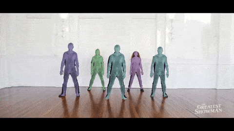

# Enhancing Human Pose Estimation in Videos: A Comparative Study of GRU and Transformer Architectures - ANU ENGN8501/COMP8539 Project

## Overview
This project is an extension of the original VIBE (Video Inference for Human Body Pose and Shape Estimation) paper by Kocabas et al. (2020). Our implementation seeks to improve upon the VIBE architecture by integrating transformer networks for temporal encoding and motion discrimination, and by utilizing an expanded training dataset. The goal is to refine 3D human pose estimation in videos, leveraging the power of transformers to capture complex temporal dependencies.

Original Paper: Kocabas, M., Athanasiou, N., & Black, M. J. (2020). VIBE: Video Inference for Human Body Pose and Shape Estimation. CVPR.

<p float="center">
  
  
</p>

Check the YouTube videos below for more details.

| Original Paper Video                                                                                                | Qualitative Results                                                                                                |
|------------------------------------------------------------------------------------------------------------|--------------------------------------------------------------------------------------------------------------------|
| [](https://www.youtube.com/watch?v=rIr-nX63dUA) | [](https://www.youtube.com/watch?v=fW0sIZfQcIs) |

<!-- <sub>Sources: left video - [https://www.youtube.com/watch?v=qlPRDVqYO74](https://www.youtube.com/watch?v=qlPRDVqYO74), right video - [https://www.youtube.com/watch?v=Opry3F6aB1I](https://www.youtube.com/watch?v=Opry3F6aB1I)
</sub> -->

> [**VIBE: Video Inference for Human Body Pose and Shape Estimation**](https://arxiv.org/abs/1912.05656),            
> [Muhammed Kocabas](https://ps.is.tuebingen.mpg.de/person/mkocabas), [Nikos Athanasiou](https://ps.is.tuebingen.mpg.de/person/nathanasiou), 
[Michael J. Black](https://ps.is.tuebingen.mpg.de/person/black),        
> *IEEE Computer Vision and Pattern Recognition, 2020* 

## Features and Contributions

This project builds upon the foundational work of the VIBE model with the following features and contributions:

- **Transformer Integration**: Replaced the GRU-based temporal encoder and motion discriminator with transformer models to explore their efficacy in capturing temporal dependencies in video data.
  
- **Dataset Expansion**: Utilized an updated and larger AMASS dataset for the motion discriminator, aiming to expose the model to a wider variety of human poses and improve its predictive performance.
  
- **Model Comparison**: Conducted a comprehensive comparison between the original VIBE model and our modified versions, providing insights into the impact of architectural changes on performance.
  
- **Performance Analysis**: Evaluated the models using standard metrics on the 3DPW test set, offering a detailed analysis of the strengths and limitations of each approach.
  
- **Open Source**: The entire project is open-sourced, including the modified codebase and environment setup, to facilitate replication and further research by the community.

These contributions are aimed at advancing the field of video-based 3D human pose estimation and providing a platform for future explorations into the use of transformer models in this domain.

## Setting Up the Project
VIBE has been implemented and tested on Ubuntu 18.04 with python >= 3.7. It supports both GPU and CPU inference.

Clone the repo:
```bash
git clone https://github.com/sriparashiva/VIBE-anu_8501.git
cd VIBE-anu_8501
```

Install the requirements using `virtualenv` or `conda`:
```bash
# pip
source scripts/install_pip.sh

# conda
source scripts/install_conda.sh
```

## Training
Run the commands below to start training:

```shell script
source scripts/prepare_training_data.sh
python train.py --cfg configs/config.yaml
```

Note that the training datasets should be downloaded and prepared before running data processing script.
Please see [`doc/train.md`](doc/train.md) for details on how to prepare them.
 
## Evaluation

Here we compare VIBE with recent state-of-the-art methods on 3D pose estimation datasets. Evaluation metric is
Procrustes Aligned Mean Per Joint Position Error (PA-MPJPE) in mm.

| Configuration                          | MPJPE   | PA-MPJPE | PVE     | ACCEL   |
|----------------------------------------|---------|----------|---------|---------|
| Baseline Model, Original Paper's Dataset | 82.9    | 51.9     | 99.1    | 23.4    |
| Baseline Model, Baseline Dataset         | 91.9928 | 56.4201  | 108.9558| 27.9665 |
| Baseline Model, Updated Dataset          | 91.2920 | 55.5521  | 108.0769| 27.5020 |
| Modified Model V1, Baseline Dataset      | 103.3061| 59.1042  | 122.8817| 19.5794 |
| Modified Model V1, Updated Dataset       | 100.9460| 62.3262  | 123.0027| 18.8801 |
| Modified Model V2, Baseline Dataset      | 101.8598| 60.1312  | 120.3034| 19.7361 |
| Modified Model V2, Updated Dataset       | 104.7027| 59.4259  | 125.0943| 16.8924 |


See [`doc/eval.md`](doc/eval.md) to reproduce the results in this table or 
evaluate a pretrained model.

## Citation

```bibtex
@inproceedings{kocabas2019vibe,
  title={VIBE: Video Inference for Human Body Pose and Shape Estimation},
  author={Kocabas, Muhammed and Athanasiou, Nikos and Black, Michael J.},
  booktitle = {The IEEE Conference on Computer Vision and Pattern Recognition (CVPR)},
  month = {June},
  year = {2020}
}
```

## References
The codebase is forked from the codebase provided by the original authors of the VIBE paper. The main contributions and modifications of our team are marked with comments in .py files. Majority of the contributions are in the following files:
- [`train.py`](train.py)
- [`eval.py`](eval.py)
- [`lib/core/config.py`](lib/core/config.py)
- [`lib/core/trainer.py`](lib/core/trainer.py)
- [`lib/data_utils/amass_utils.py`](lib/data_utils/amass_utils.py)
- [`lib/dataset/amass.py`](lib/dataset/amass.py)
- [`lib/models/motion_discriminator.py`](lib/models/motion_discriminator.py)
- [`lib/models/vibe.py`](lib/models/vibe.py)
- [`lib/utils/utils.py`](lib/utils/utils.py)
- [`lib/core/config.py`](lib/core/config.py)
- [`lib/core/config.py`](lib/core/config.py)

